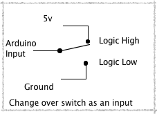
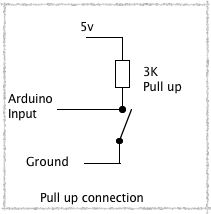
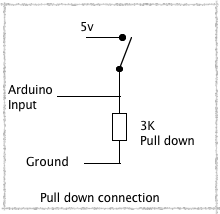

Swiftboard 是一块国产的 A10 芯片的 ARM 开发板。物美价廉。而 A10 芯片几乎是最便宜的 Cotrex-A8 1Ghz 芯片，性价比非常高。（200 块钱的电视棒都是这个方案）

最重要的是，文档很齐全，内核开源。屌炸天！

GPIO 就是直接操作管脚的高低电平，用最原始的方式驱动其他硬件。

Swiftboard 的 GPIO 管脚对应
-
A10 芯片的管脚编号如下：

PA0, PA1, PA2 ... PB0, PB1, PB2, .... PS0, PS1 ...

在 swiftboard 的原理图 pdf 中搜索管脚值就可以找到对应管脚啦。我整理后如下：

修改 script.bin 文件
-

	# 在板子上拷贝出 script.bin
	$ mount /dev/nanda /media/nanda
	$ ls /media/nanda/script.bin

	# 安装 sunxi-tools
	$ git clone https://github.com/linux-sunxi/sunxi-tools.git
	$ cd sunxi-tools
	$ make 
	$ ./bin2fex script.bin > script.fex
	$ vi script.fex

这个文件描述了芯片的哪些管脚被分配为做什么。如果你要用哪个管脚，必须先关闭对应的功能模块，然后这个管脚才能作为 GPIO 使用。

比如说，我要使用 PI10 管脚。发现它属于 SPI 模块的 cs0 管脚。所以要关闭 SPI 模块，把 spi_used 要设置为 0。

	198 [spi0_para]
	199 spi_used = 0
	200 spi_cs_bitmap = 1
	201 spi_cs0 = port:PI10<3><default><default><default>
	202 spi_sclk = port:PI11<3><default><default><default>
	203 spi_mosi = port:PI12<3><default><default><default>
	204 spi_miso = port:PI13<3><default><default><default>

然后 

	$ ./fex2bin script.fex > script.bin
	# 再把 script.bin 拷贝到板子的 nanda 分区，并且重启生效

GPIO 寄存器
-
寄存器有四种：

* CFG 寄存器，配置管脚用于输入或者输出
* DAT 寄存器，读取设置管脚高低电平
* PUL 寄存器，设置上拉电阻或下拉电阻
* INT 寄存器，设置管脚的中断触发方式

上拉电阻与下拉电阻
-
一开始我设置管脚为输入，但读取到的值飘忽不定，时而0时而1。后来查阅资料，发现还有“上拉”和“下拉”这回事儿。

如果把管脚和地线连起来，那肯定就是0了。和电源连起来，肯定就是1。但是悬空的话，就是飘忽不定。如果拿GPIO来做按钮要咋整呢？

像这样，接通的时候和电源连起来，断开的时候和地线连起来。这种方法看上去可行，但不是每个按钮都是三条线的，而且切换的时候还是会悬空，还是飘忽不定，会产生噪音。

所以某个高手发明了这个屌炸天的方法：

这样的话，在断开的时候，输入为1，连通的时候为0。而且不会有噪声。

同理，也可以下拉：

GPIO 中断
-
GPIO 中断有几种触发模式：

* 上升触发，当电平从 0 变成 1 的时候触发
* 下降触发，当电平从 1 变成 0 的时候触发
* 上升下降都触发

不是所有的 GPIO 引脚都有中断，只有 32 个引脚有关联的中断。

在内核模块访问寄存器
-
很不幸的发现，A10 的 GPIO 驱动是一个老外写的，并不完整，直接忽略掉了上拉下拉的设置部分。

我打算用 /dev/mem 设备读写物理内存，但发现这个设备也被编译选项禁用了。
所以被迫要写一个内核模块了。

我又很不幸发现，厂商给的里面没有对应的源码，所以要用这种方法编译内核模块。（xx）

在内核里面访问物理内存相当简单。直接使用 ioremap 即可。

	void *gpio_base = ioremap(0x01c20800, 0x400);

地址和长度在 A10 Datasheet 里面有提到。

然后新建一个字符设备，方便在用户态访问：

	#define MAJOR_NUM 232

	if (register_chrdev(MAJOR_NUM, "hello", &hello_fops)) {
		printk(KERN_ALERT "hello init: failed register %d, %d\n", MAJOR_NUM, 0);
		return -EINVAL;
	}

在内核模块设置中断
-
A10 中的其他驱动已经预先设置好了 GPIO 的终端号，直接使用 request_irq 绑定中断处理函数即可。

	static __u32 irqstat;

	static int hello_read(struct file *filp, char __user *buf, size_t count, loff_t *f_pos) {
		int r;

		// 等待中断发生，然后返回中断的状态
		interruptible_sleep_on(&irq_queue);
		if (count >= 4)
			r = copy_to_user(buf, &irqstat, 4);
		return count;
	}

	static irqreturn_t irq_handler(int irq, void *devid) {
		__u32 status = 0;
		void *reg = gpio_base + 0x214; // 中断寄存器地址
		int i;
	
		// 读取中断寄存器
		status = *(__u32 *)(reg);
		for (i = 0; i < 32; i++) {
			if (status & (1<<i)) {
				// 清除中断位，不然就不会继续产生中断了
				*(__u32 *)(reg) = 1<<i;
			}
		}
		irqstat = status;

		// 唤醒读队列
		wake_up_interruptible(&irq_queue);
	
		return IRQ_HANDLED;
	}

	// SW_INT_IRQNO_PIO = 28 这个是在 arch/arm/plat 里面定义的
	err = request_irq(28, irq_handler,
			IRQF_SHARED, "sunxi-gpio", (void *)0x1653);
	if (err != 0) {
		printk(KERN_ALERT "hello init: request irq failed: %d\n", err);
		return -EINVAL;
	}

这段代码达到的效果就是，读取 /dev/gpio 设备的时候会阻塞，直到有中断来的时候，返回四字节代表当前的中断状态，然后就能知道是哪根引脚发生了中断。

-
内核模块（）。
	
	mknod /dev/gpio c 232 0
	insmod gpio.ko

用户态（）。

	# 编译
	cd mmap-gpio
	GOARCH=arm go build .

参考资料
-
[Fex Guide](http://linux-sunxi.org/Fex_Guide)

[GPIO 入门](https://github.com/cubieplayer/Cubian/wiki/GPIO%E5%85%A5%E9%97%A8)

[上拉与下拉的解释](http://www.thebox.myzen.co.uk/Tutorial/Inputs.html)

[A10 datasheet](http://linux-sunxi.org/A10)

[A10 内核以及工具的开源代码](https://github.com/linux-sunxi)
